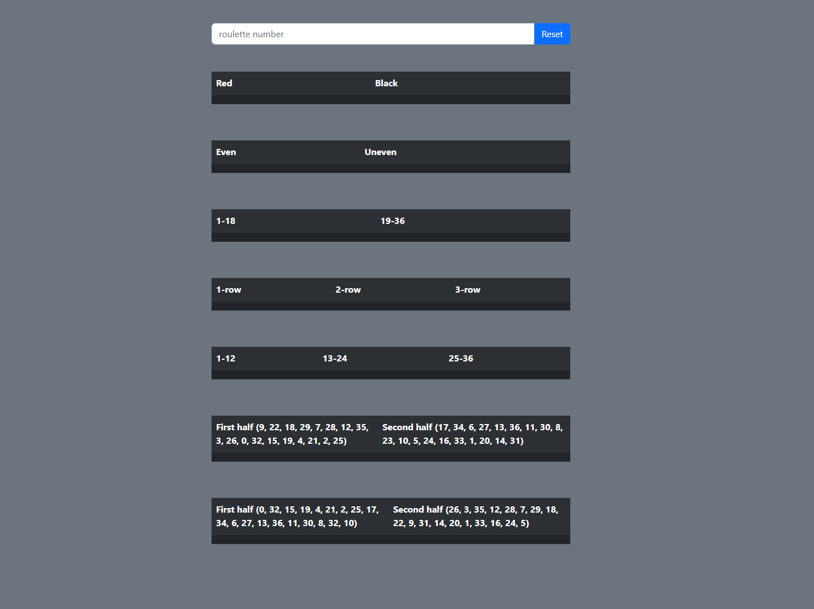
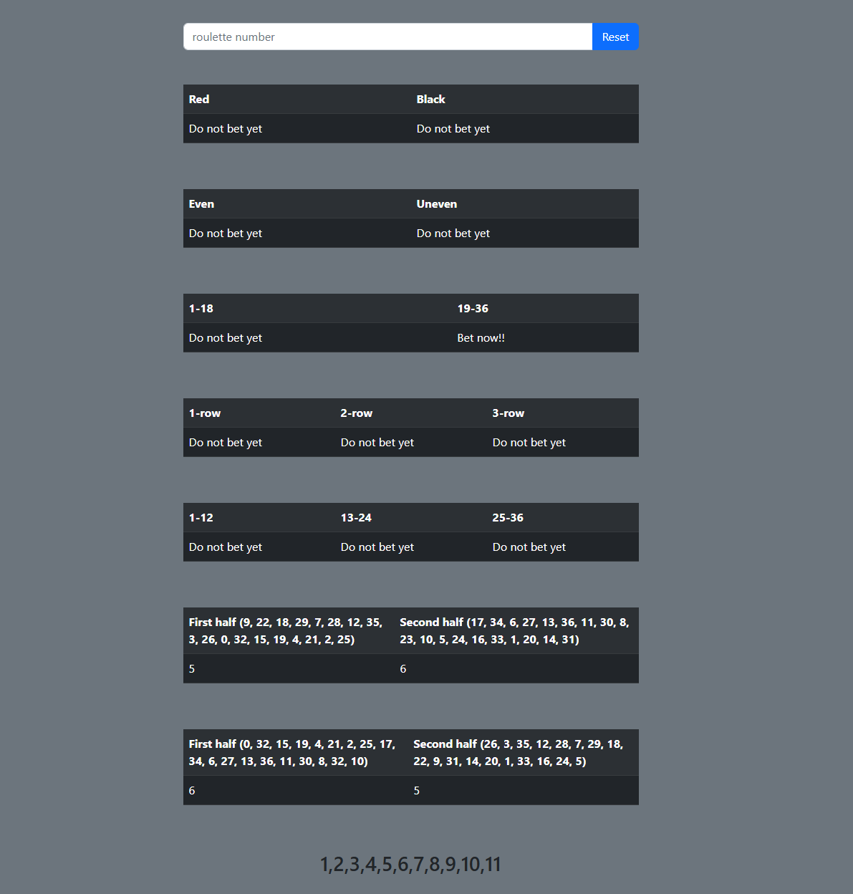

# Roulette-chance-fun
calculates the amount of times an even or 1/3 of a roulette has been hit in a row.
Number for the amount of when to say it's safe on the opposite can be changed in the code, it's currently 7.
This was a fun project and by all means not a way to earn money in a casino. THIS WAS FOR FUN!!!

## Examples

